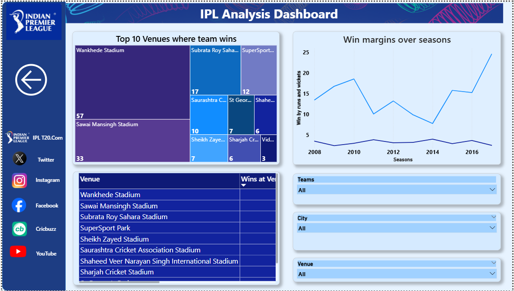

# IPL Analysis — Power BI + Python (EDA)

End-to-end IPL analytics project: Python EDA for cleaning/prep, interactive Power BI dashboards (batting/bowling/fielding/toss/venues), and a slide/PDF report.

## 📁 Repository Structure

## 🎯 Problem Statement
Turn raw IPL match and ball-by-ball data into **actionable insights**:
- Who are the top performers (batting, bowling, fielding)?
- Does winning the toss meaningfully improve win chances?
- Which venues are “lucky” for which teams?
- How do performance trends change across seasons?

## 🛠️ Methodology & Tools
- **Python (Google Colab / Jupyter)** for EDA:
  - Merge & sanity checks, remove duplicates, standardize `city`/`venue` spellings.
  - Validate numeric fields, handle nulls, ensure consistent data types.
- **Power BI** for:
  - **Data model**: `Matches[id] (1)` → `Deliveries[match_id] (*)`, cross-filter **Both**.
  - **DAX measures** for KPIs and derived metrics.
  - **Interactive visuals** (cards, bar/column/line, donut, treemap, map) + **slicers**.

## 🧹 Data Cleaning (high-level)
- Removed nulls and duplicate rows.
- Normalized names for `city`, `venue`, and teams.
- Derived **legal ball** flag to exclude wides/noballs in balls-counting metrics.
- Ensured consistent joins between deliveries and matches by `match_id`.

## 📊 Dashboard Pages (screenshots)
**Overview**  

**Batting**  

**Bowling**  

**Fielding & Toss**  

**Venue Insights**  

## 🔢 Key DAX (full library in (`dax/dax-measures)
- KPI totals (matches, runs, 4s, 6s)
- Batting: runs, balls faced, strike rate, fours/sixes
- Bowling: wickets, overs, economy, maidens; powerplay/death phase metrics
- Fielding: catches, runouts, dismissals
- Toss: Tosses Won, Wins After Toss, Win% After Toss
- Venues: Wins/Matches/Win% at venue (team-aware), wins by venue

## 🔎 Insights (examples)
- **MI & CSK** are consistently top performers over seasons.
- **Yuvraj Singh / YK Pathan** show strong power-hitting & SR.
- **Z Khan / YS Chahal** lead in wickets; powerplay vs death economy highlights bowler roles.
- Winning the toss converts to a match win only ~**51%** of the time.
- Teams show **venue affinity** (e.g., Wankhede/Sawai Mansingh are consistently favorable).

## 🧭 Reproduce Locally
1. Put `deliveries.csv` & `matches.csv` into `/data/`.
2. In Power BI:
   - Create the relationship **Matches[id] → Deliveries[match_id]** (cross-filter **Both**).
   - Paste measures from `dax/DAX_measures.md`.
   - Build visuals per the screenshots; add slicers for **Season**, **Teams**, **Venue/City**.
3. Add the EDA notebook to `/eda/`.
